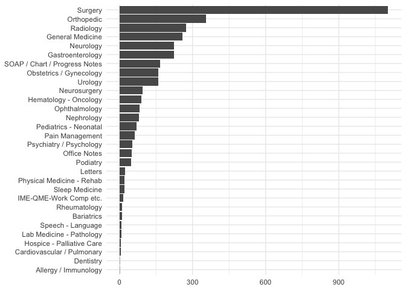
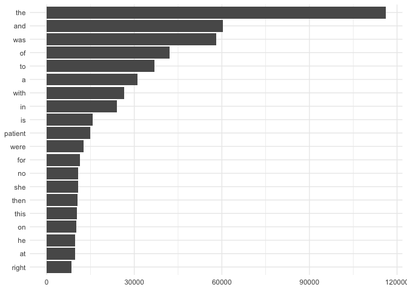
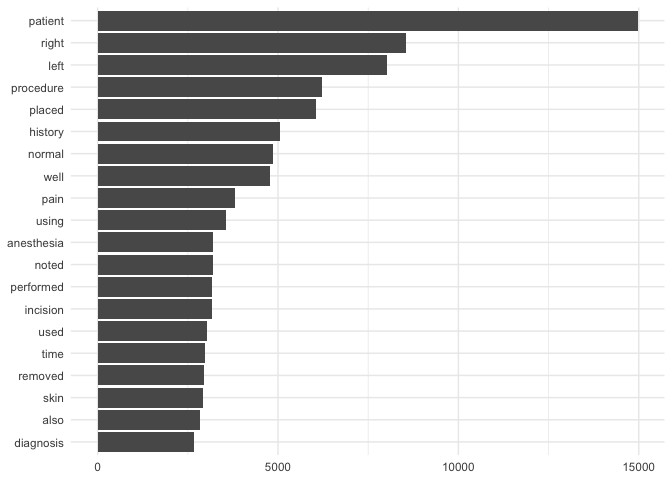
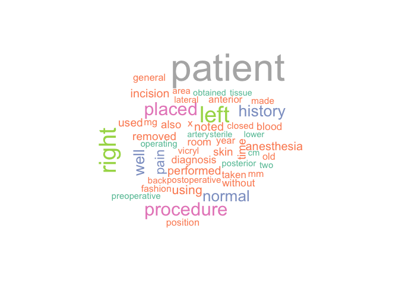
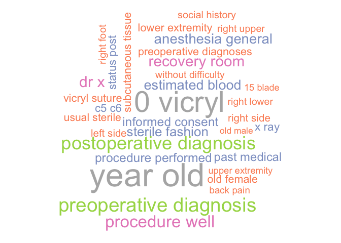
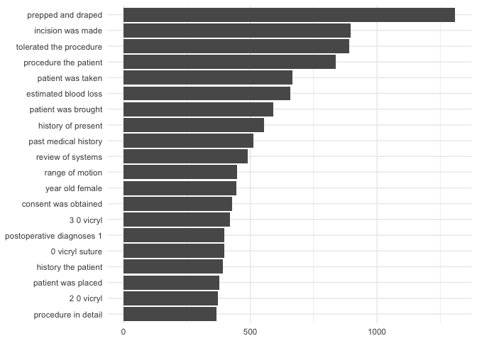
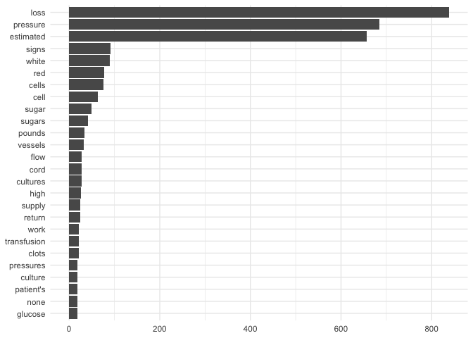
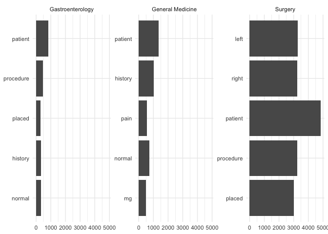
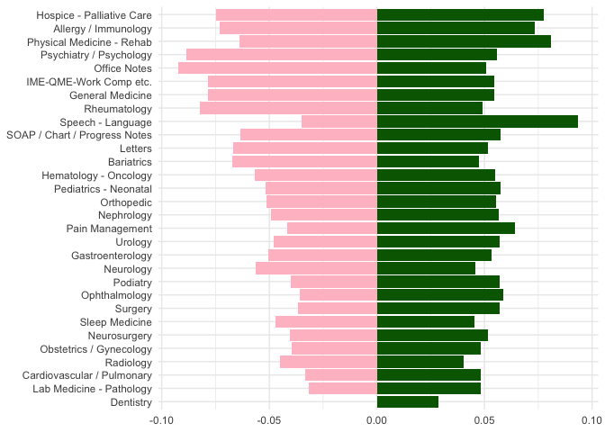

Lab 08 - Text Mining
================
March 01, 2023

# Learning goals

- Use `unnest_tokens()` and `unnest_ngrams()` to extract tokens and
  ngrams from text.
- Use dplyr and ggplot2 to analyze text data

# Lab description

For this lab we will be working with the medical record transcriptions
from <https://www.mtsamples.com/>. And is loaded and “fairly” cleaned at
<https://github.com/JSC370/jsc370-2023/blob/main/data/medical_transcriptions/>.

### Setup packages

You should load in `dplyr`, (or `data.table` if you want to work that
way), `ggplot2` and `tidytext`. If you don’t already have `tidytext`
then you can install with

``` r
install.packages("tidytext")
```

### Read in Medical Transcriptions

Loading in reference transcription samples from
<https://www.mtsamples.com/>

``` r
library(tidytext)
library(readr)
library(dplyr)
library(tidyr)
library(ggplot2)
data_url <- paste0(
  "https://raw.githubusercontent.com/JSC370/",
  "jsc370-2023/main/data/medical_transcriptions/mtsamples.csv"
  )
mt_samples <- read_csv(data_url)
mt_samples <- mt_samples |>
  select(description, medical_specialty, transcription)
head(mt_samples)
```

    ## # A tibble: 6 × 3
    ##   description                                                    medic…¹ trans…²
    ##   <chr>                                                          <chr>   <chr>  
    ## 1 A 23-year-old white female presents with complaint of allergi… Allerg… "SUBJE…
    ## 2 Consult for laparoscopic gastric bypass.                       Bariat… "PAST …
    ## 3 Consult for laparoscopic gastric bypass.                       Bariat… "HISTO…
    ## 4 2-D M-Mode. Doppler.                                           Cardio… "2-D M…
    ## 5 2-D Echocardiogram                                             Cardio… "1.  T…
    ## 6 Morbid obesity.  Laparoscopic antecolic antegastric Roux-en-Y… Bariat… "PREOP…
    ## # … with abbreviated variable names ¹​medical_specialty, ²​transcription

------------------------------------------------------------------------

## Question 1: What specialties do we have?

We can use `count()` from `dplyr` to figure out how many different
categories we have. Are these categories related? overlapping? evenly
distributed?

``` r
# Number of rows
mt_samples |> count(medical_specialty, sort = TRUE)
```

    ## # A tibble: 30 × 2
    ##    medical_specialty                 n
    ##    <chr>                         <int>
    ##  1 Surgery                        1103
    ##  2 Orthopedic                      355
    ##  3 Radiology                       273
    ##  4 General Medicine                259
    ##  5 Gastroenterology                223
    ##  6 Neurology                       223
    ##  7 SOAP / Chart / Progress Notes   166
    ##  8 Obstetrics / Gynecology         160
    ##  9 Urology                         158
    ## 10 Neurosurgery                     94
    ## # … with 20 more rows

``` r
mt_samples %>% 
  count(medical_specialty, sort = TRUE) %>% 
  mutate(medical_specialty = forcats::fct_reorder(medical_specialty, n)) %>% 
  ggplot(aes(x = medical_specialty, y = n)) +
  theme_minimal() +
  geom_col() +
  coord_flip() +
  labs(
    x = NULL, y = NULL
  )
```

<!-- -->

``` r
# another userful func forcats::fct_inorder()
```

There are a total of 30 categories that are not evenly distributed shown
in the plot, and the category Surgery has the most observations over
1100, while the smallest category has only 1 observation.  
The medical specialty category might be overlapping, e.g. surgery with
others, which requires specialist knowledge in the medical area.

------------------------------------------------------------------------

## Question 2

- Tokenize the the words in the `transcription` column
- Count the number of times each token appears
- Visualize the top 20 most frequent words

Explain what we see from this result. Does it makes sense? What insights
(if any) do we get?

``` r
tokens <- mt_samples %>% 
  select(transcription) %>% 
  unnest_tokens(word, transcription) %>% 
  count(word) 
nrow(tokens)
```

    ## [1] 22830

``` r
tokens %>% 
  slice_max(n, n = 20) %>%  # 1st n is the column name of count
  ggplot(aes(reorder(word, n), n), n) +
  geom_bar(stat="identity")+
  theme_minimal() +
  coord_flip() +
  labs(x = NULL, y = NULL)
```

<!-- -->

The most frequent word is “the” which makes sense as it is often used,
but it is meaningless for the objective. In the top 20 frequency words,
most of them are stopwords that to be removed later, besides, the most
useful word for the study might be “patient”.

------------------------------------------------------------------------

## Question 3

- Redo visualization for the top 20 most frequent words after removing
  stop words
- Bonus points if you remove numbers as well

What do we see know that we have removed stop words? Does it give us a
better idea of what the text is about?

``` r
library(stopwords)
head(stopwords("english"))
```

    ## [1] "i"      "me"     "my"     "myself" "we"     "our"

``` r
length(stopwords("english"))
```

    ## [1] 175

``` r
tokens_no_stopwords <- tokens %>% 
  filter(
    !word %in% stopwords("english"),
    #remove numbers with grepl or string::str_detect
    !grepl("^[[:digit:]]+$", word)
    )
tokens_no_stopwords %>% 
  slice_max(n, n = 20) %>%  # 1st n is the column name of count
  ggplot(aes(reorder(word, n), n), n) +
  geom_bar(stat="identity")+
  theme_minimal() +
  coord_flip() +
  labs(x = NULL, y = NULL)
```

<!-- -->

After removing the stopwords, the top 20 most frequent words give a
better insight into the data. The top one is “patient” which matches
what we have before removing.

Another method for visualizing word counts is using a word cloud via
`wordcloud::wordcloud()`. Create a world cloud for the top 50 most
frequent words after removing stop words (and numbers).

``` r
# install.packages('wordcloud')
# install.packages('RColorBrewer')
library(wordcloud)
library(RColorBrewer)
```

``` r
tokens50 <- tokens_no_stopwords %>% 
  slice_max(n, n = 50)

wordcloud(tokens50$word, tokens50$n, 
          colors = brewer.pal(8, "Set2"))
```

<!-- -->

------------------------------------------------------------------------

# Question 4

Repeat question 3, but this time tokenize into bi-grams. How does the
result change if you look at tri-grams? (You don’t need to create the
word clouds.)

``` r
# start with any of stop words
sw_start <- paste0("^", paste(stopwords("english"), collapse = " |^"))
# end with any of stop words
sw_end <- paste0(" ", paste(stopwords("english"), collapse = "$| "), "$")

tokens_bigram <- mt_samples %>% 
  select(transcription) %>% 
  unnest_tokens(ngram, transcription, token = "ngrams", n = 2) %>% 
  filter(
    # remove those with stop words
    !grepl(sw_start, ngram, ignore.case = TRUE),
    !grepl(sw_end, ngram, ignore.case = TRUE)
  ) %>% 
  count(ngram)
```

``` r
# bar plots
tokens_bigram %>% 
  filter(
    !grepl("^[[:digit:]]+\\s[[:digit:]]+$", ngram)
  )%>%
  slice_max(n, n = 20) %>%  
  ggplot(aes(reorder(ngram, n), n), n) +
  geom_bar(stat="identity")+
  theme_minimal() +
  coord_flip() +
  labs(x = NULL, y = NULL)
```


``` r
temp <- tokens_bigram %>% 
  filter(
    !grepl("^[[:digit:]]+\\s[[:digit:]]+$", ngram)
  ) %>% 
  slice_max(n, n = 50)
wordcloud(temp$ngram, temp$n, 
          colors = brewer.pal(8, "Set2"))
```

<!-- -->

``` r
# tri-grams
tokens_trigram <- mt_samples %>% 
  select(transcription) %>% 
  unnest_tokens(ngram, transcription, token = "ngrams", n = 3) %>% 
  filter(
    # remove those with stop words
    !grepl(sw_start, ngram, ignore.case = TRUE),
    !grepl(sw_end, ngram, ignore.case = TRUE)
  ) %>% 
  count(ngram)

tokens_trigram %>% 
  slice_max(n, n = 20) %>%  
  ggplot(aes(reorder(ngram, n), n), n) +
  geom_bar(stat="identity")+
  theme_minimal() +
  coord_flip() +
  labs(x = NULL, y = NULL)
```

<!-- -->

------------------------------------------------------------------------

# Question 5

Using the results you got from question 4. Pick a word and count the
words that appears after or before it. (Also, try finding pairs of words
after and before the word. )

``` r
library(stringr)
# e.g., blood
tokens_bigram %>% 
  filter(str_detect(ngram, regex("\\sblood$|^blood\\s"))) %>%  
  # find pairs with "blood" then remove the word "blood"
  mutate(word = str_remove(ngram, "blood"),
         word = str_remove_all(word, " ")) %>% 
  # sum up for "xxx blood" and "blood xxx"
  group_by(word) %>% 
  summarise(n = sum(n)) %>% 
  filter(!grepl("^[[:digit:]]+$", word)) %>% 
  slice_max(n, n = 25) %>% 
  ggplot(aes(reorder(word, n), n), n) +
  geom_bar(stat="identity")+
  theme_minimal() +
  coord_flip() +
  labs(x = NULL, y = NULL)
```

<!-- -->

------------------------------------------------------------------------

# Question 6

Which words are most used in each of the specialties. you can use
`group_by()` and `top_n()` from `dplyr` to have the calculations be done
within each specialty. Remember to remove stop words. How about the most
5 used words?

``` r
top_by_sp <- mt_samples %>% 
  select(medical_specialty, transcription) %>% 
  unnest_tokens(word, transcription) %>% 
  filter(
    !word %in% stopwords("english"),
    #remove numbers with grepl or string::str_detect
    !grepl("^[[:digit:]]+$", word)
    )%>%
  count(medical_specialty, word) 

# most used word in each speciality
top_by_sp %>% 
  group_by(medical_specialty)%>% 
  slice_max(n, n = 1) %>% 
  arrange(desc(n))
```

    ## # A tibble: 32 × 3
    ## # Groups:   medical_specialty [30]
    ##    medical_specialty             word        n
    ##    <chr>                         <chr>   <int>
    ##  1 Surgery                       patient  4855
    ##  2 Orthopedic                    patient  1711
    ##  3 General Medicine              patient  1356
    ##  4 Gastroenterology              patient   835
    ##  5 Urology                       patient   776
    ##  6 Radiology                     left      701
    ##  7 Neurology                     right     694
    ##  8 Obstetrics / Gynecology       patient   628
    ##  9 SOAP / Chart / Progress Notes patient   537
    ## 10 Psychiatry / Psychology       patient   532
    ## # … with 22 more rows

``` r
# the most 5 used words
top_by_sp %>% 
  group_by(medical_specialty)%>% 
  slice_max(n, n = 5) %>% 
  filter(medical_specialty %in% c("General Medicine", "Gastroenterology", "Surgery")) %>% 
  ggplot(aes(reorder(word, n), n)) +
  geom_bar(stat="identity")+
  theme_minimal() +
  coord_flip() +
  facet_wrap(~ medical_specialty, 
             scales = "free_y") +
  labs(x = NULL, y = NULL)
```

<!-- -->

# Question 7 - extra

Find your own insight in the data:

Ideas:

- Use TF-IDF to see if certain words are used more in some specialties
  then others. Compare the list of words compared to the list from
  Question 6.

``` r
tf_idf_by_specialty <- mt_samples %>% 
  unnest_tokens(word, transcription) %>% 
  filter(
    !word %in% stopwords("english")
  ) %>% 
  count(word, medical_specialty) %>% 
  bind_tf_idf(word, medical_specialty, n)

tf_idf_by_specialty %>% 
  group_by(medical_specialty) %>% 
  slice_max(tf_idf, n = 5) %>%  # measures the importance of specialty 
  filter(medical_specialty %in% c("Surgery", "Dentistry", "Allergy / Immunology")) %>% 
  ggplot(aes(reorder(word, tf_idf), tf_idf)) +
  geom_bar(stat="identity")+
  theme_minimal() +
  coord_flip() +
  facet_wrap(~ medical_specialty, scales = "free_y") +
  labs(x = NULL, y = NULL)
```

<!-- -->

The TF_IDF for words in Surgery category is quite low, it might because
those words are important in Surgery cate but also show in other
categories.

- Sentiment analysis to see if certain specialties are more optimistic
  than others. How would you define “optimistic”?

``` r
sentiment_list <- get_sentiments("bing")

sentiments_in_med <- tf_idf_by_specialty %>% 
  left_join(sentiment_list, by = "word")

sentiments_in_med_by_sp <- sentiments_in_med %>% 
  group_by(medical_specialty) %>% 
  summarise(
    n_positive = sum(ifelse(sentiment == "positive", n, 0), na.rm = TRUE),
    n_negative = sum(ifelse(sentiment == "negative", n, 0), na.rm = TRUE),
    n = sum(n)
  )

sentiments_in_med_by_sp %>% 
  ggplot(aes(reorder(medical_specialty, (n_negative + n_positive)/n)))+
  theme_minimal()+
  geom_col(aes(y = - n_negative / n), fill = "pink") +
  geom_col(aes(y = n_positive / n), fill = "darkgreen") +
  labs(x = NULL, y = NULL) +
  coord_flip()
```

<!-- -->

The category “Speech-Language” displays a greater frequency of positive
words in contrast to the other categories. Conversely, the plot
indicates that the “Dentistry” category does not exhibit any negative
words.

- Find which specialty writes the longest sentences.

``` r
mt_samples %>% 
  select(medical_specialty, transcription) %>% 
  unnest_tokens(output = sentence, transcription, token = "sentences") %>% 
  mutate(num_words = str_count(sentence, "\\S+")) %>% 
  group_by(medical_specialty) %>% 
  summarise(
    max_words = max(num_words, na.rm = T),
    avg_words = mean(num_words, na.rm = T)
  ) %>% 
  arrange(desc(max_words))
```

    ## # A tibble: 30 × 3
    ##    medical_specialty       max_words avg_words
    ##    <chr>                       <int>     <dbl>
    ##  1 General Medicine              253      13.1
    ##  2 Office Notes                  253      11.3
    ##  3 Neurosurgery                  241      18.3
    ##  4 Orthopedic                    241      16.9
    ##  5 Surgery                       241      16.5
    ##  6 Nephrology                    196      14.5
    ##  7 Radiology                     180      16.2
    ##  8 Psychiatry / Psychology       173      18.2
    ##  9 Podiatry                      172      17.8
    ## 10 Urology                       161      16.3
    ## # … with 20 more rows

In the dataset, the category of General Medicine and Office Notes
composed the lengthiest sentence, which contained 253 words.

# Deliverables

1.  Questions 1-7 answered, pdf or html output uploaded to Quercus
